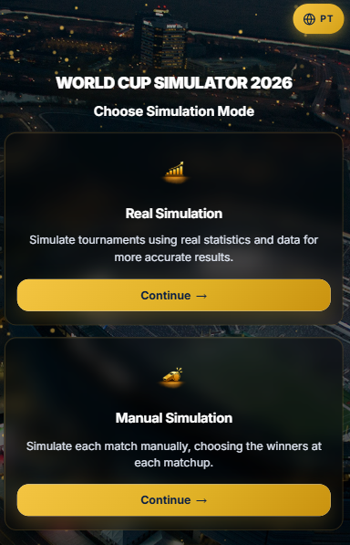
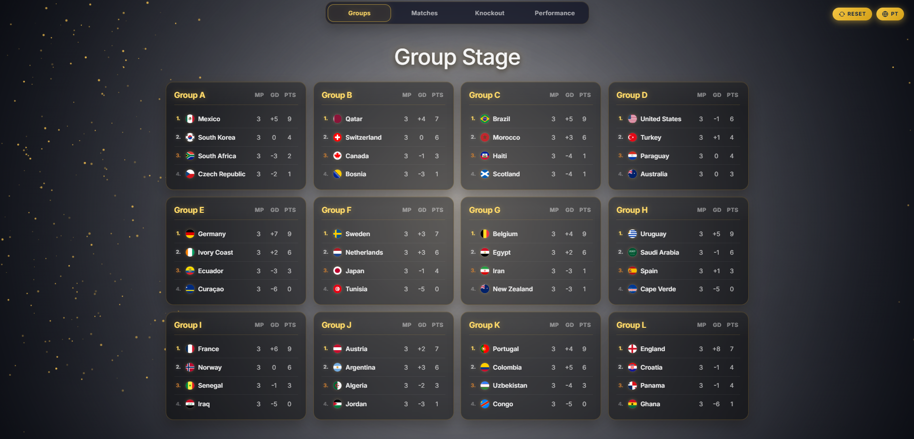
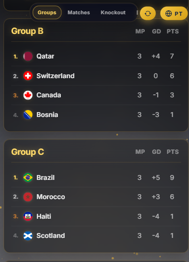
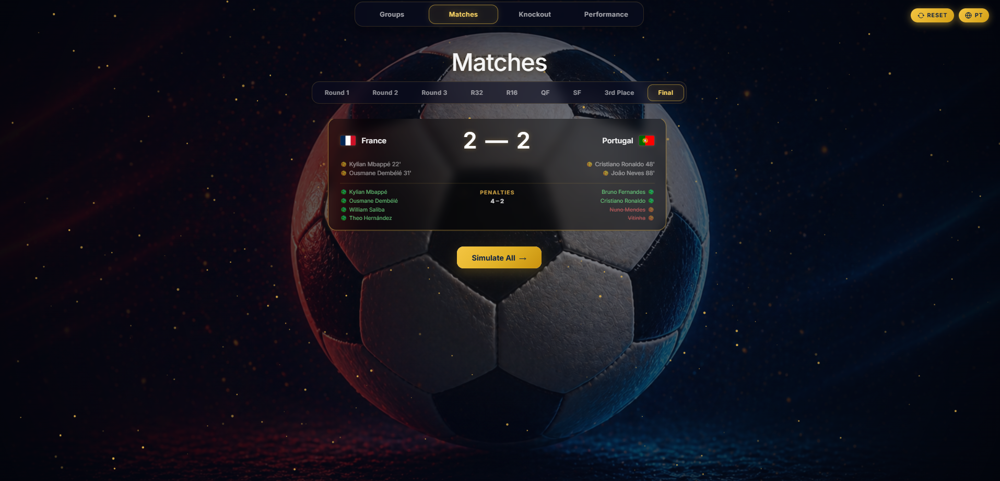
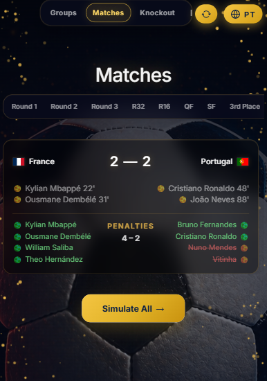
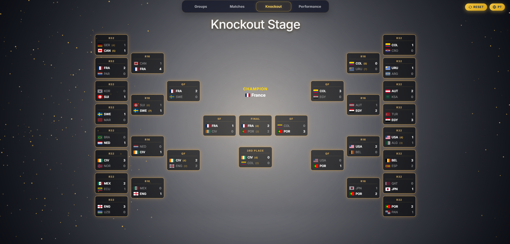
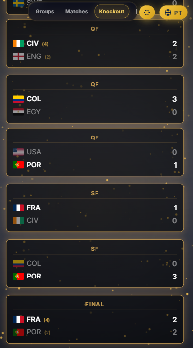
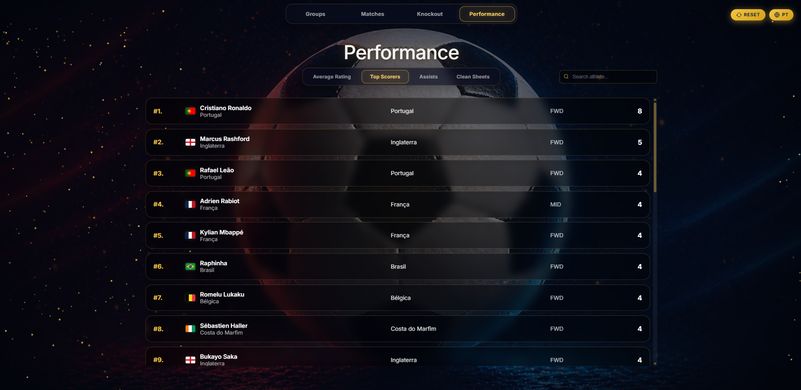
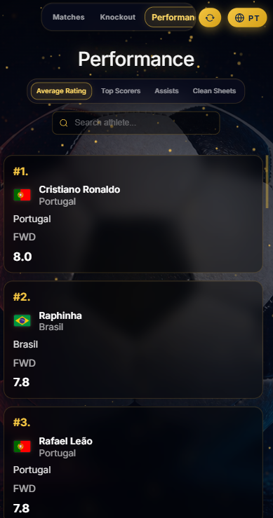
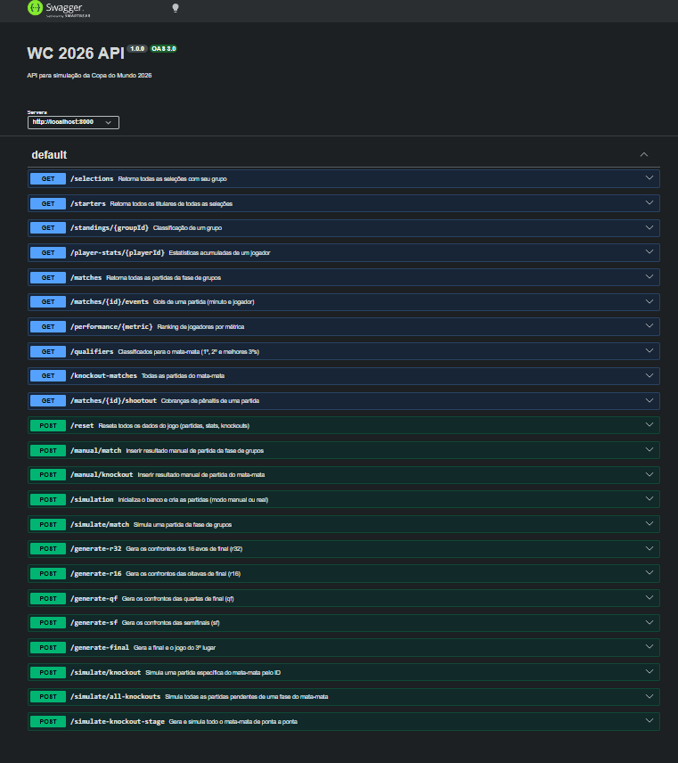

# ⚽ WC-2026 — World Cup Simulator System


Full-stack web application developed to simulate the FIFA World Cup 2026, including group stage logic, best third-place qualification, knockout generation, and player-level statistics, supporting both probabilistic automatic simulation and fully manual match input modes.

🔗 **Live Demo:** https://wc2026simulador.com/

## 📸 Screenshots

Below are some views of the application, including group stage management, knockout bracket generation, and mobile responsiveness.

### ⚽ Mode Selection




### 📊 Group Stage





## 🆚 Matches





### 🏆 Knockout Stage





### 📈 Player Performance Ranking





## 💡 Context

With the FIFA World Cup expanding to **48 teams** in 2026, the tournament format became more complex, especially regarding group-stage qualification, best third-place teams, and knockout bracket generation.

The idea came up when I noticed that many existing simulators only allow users to manually choose results or generate automatic simulations that feel random, without any clear statistical basis behind them.

This project was created to simulate the **entire World Cup 2026 structure**, allowing both automated statistical simulation and manual match control in the same system.

## 📁 Project Structure

```
wc-2026/
├─ backend/
│  ├─ seed/
│  │  ├─ selections.json        # Teams and players dataset
│  │  └─ seed.js                # Database seed script
│  │
│  └─ src/
│     ├─ server.js              # Express API + database setup
│     └─ simulation-logic.js    # Match simulation algorithms
│
├─ frontend/
│  ├─ css/
│  ├─ img/
│  ├─ js/
│  │  ├─ config.js              # API base URL configuration
│  │  ├─ translation.js         # i18n system (PT / EN)
│  │  ├─ particles.js           # Canvas particle background animation
│  │  ├─ simulation.js          # Mode selection logic and navigation
│  │  ├─ game-real.js           # Automatic simulation mode logic
│  │  └─ game-manual.js         # Manual mode logic
│  │
│  ├─ simulation.html           # Entry point — mode selection
│  ├─ game-real.html
│  ├─ game-manual.html
│  ├─ robots.txt                # Search engine crawl rules
│  └─ sitemap.xml               # Sitemap for Google indexing
│
├─ .env
├─ package.json
└─ README.md
```

## ⚙️ How It Works

1. User selects a simulation mode: **real** or **manual**
2. The system generates all **group stage matches**
3. Matches are either:
   - simulated automatically using probability models
   - entered manually by the user
4. Group standings are updated dynamically
5. Qualified teams advance to the knockout rounds
6. Knockout matches are generated automatically
7. Player statistics and match events are recorded
8. The tournament progresses until the final match

## ⚽ Simulation Logic

### Automatic Simulation Mode

Match results are generated using:

- FIFA ranking data  
- average rating of starting players  
- probability calculations based on ELO logic  
- Poisson distribution for expected goals (**xG**)  

The system simulates:

- match scores  
- scorers  
- assists  
- player ratings  
- clean sheets  
- minute-by-minute goal events  
- penalty shootouts  

### Manual Mode

Allows users to:

- manually enter match scores  
- simulate custom tournament scenarios  
- automatically calculate group standings  
- determine knockout winners  


## 🗄️ Database Design

The system uses a relational database structured to manage the following main entities:

- groups
- selections
- players
- matches
- group_standings
- knockout_matches
- player_match_stats
- goal_events
- shootout_events

This design allows:

- persistent match tracking  
- real-time standings calculation  
- player performance tracking  
- tournament progression logic  

## 📡 API Documentation

Swagger documentation is available at: [Swagger](http://localhost:8000/docs)



## 🌐 Deployment & SEO

The application is deployed on **Hostinger** using Node.js hosting with a custom domain.

Production setup:
- Entry point: `backend/src/server.js`
- Frontend served as static files via `express.static`, with `simulation.html` as the index
- Environment variables configured via `.env`: `DB_HOST`, `DB_USER`, `DB_PASSWORD`, `DB_NAME`, `PORT`, `FRONTEND_URL`

SEO configuration:
- `robots.txt` — allows full crawling by search engines
- `sitemap.xml` — submitted to Google Search Console; canonical root URL points to `simulation.html`
- `simulation.html` includes full meta tags: `title`, `description`, `keywords`, Open Graph, Twitter Card, and `hreflang` for PT/EN
- `translation.js` dynamically updates `document.lang`, `<title>`, and all meta tags on language switch

## 🌍 Internationalization

The application supports **Portuguese (PT-BR)** and **English (EN)** via a custom i18n system:

- Language stored in `localStorage` and persisted across pages
- All UI strings defined in `frontend/js/translation.js`
- `hreflang` tags configured for bilingual SEO indexing

## 📖 References

- [FIFA World Cup 2026 Official Format](https://www.fifa.com/pt/tournaments/mens/worldcup/canadamexicousa2026)
- [FIFA Ranking Data](https://inside.fifa.com/fifa-world-ranking/men) — Last update: 12/04/2026
- [MySQL Documentation](https://dev.mysql.com/)
- [Simulator Reference](https://interativos.ge.globo.com/futebol/copa-do-mundo/especial/simulador-da-copa-do-mundo-2026)
- [Players Reference](https://www.sofascore.com/pt) — Last update: 24/04/2026
- [UI Components Inspiration](https://uiverse.io/SamiBouchareb/warm-catfish-72)
- [UI Components Inspiration](https://uiverse.io/JaydipPrajapati1910/dry-frog-0)
- [UI Components Inspiration](https://uiverse.io/alexruix/slippery-frog-10)
- [UI Components Inspiration](https://uiverse.io/aryamitra06/silent-lion-21)

## 👨‍💻 Author

**Lucas Nicolau** — Software Engineering Student at [@UFAM](https://www.ufam.edu.br).